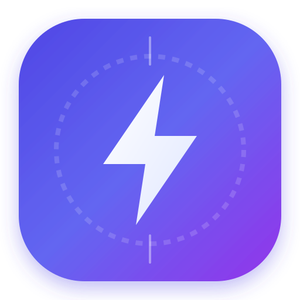

<div align="center">

  

  # ⚡ Hızlı Okuma Web (Rapid Focus)
  
  **Bilimsel RSVP & Spritz ORP Odak Algoritması, Biyonik Okuma, 5x5 Schulte Periferik Tablosu ve Sakkadik Göz Jimnastiği Platformu**

  [](https://nextjs.org)
  [](https://react.dev)
  [](https://www.typescriptlang.org)
  [](https://tailwindcss.com)
  [](LICENSE)
  [](https://hizli-oku-ebon.vercel.app)

</div>

---

## 🌟 Öne Çıkan Özellikler

### 1. 🧠 Spritz ORP (Optimal Recognition Point) ve RSVP Motoru
- **Sabit Odak Çizgisi**: Her kelimenin optik tanıma noktası (%25-35 aralığındaki harf) özel renk vurgusu ile ekran merkezindeki çentiklere kilitlenir. Gözün satırlar arasında lüzumsuz sıçrama ihtiyacını tamamen ortadan kaldırır.
- **Akıllı Noktalama Gecikmesi**: Nokta, soru işareti ve ünlemde (+%70), virgülde (+%35) dinamik bekleme süreleri tanıyarak beynin kavrama oranını maksimize eder.
- **Canlı Cümle Bağlamı (Context Breadcrumb)**: Okunan kelimenin içinde bulunduğu cümleyi alt satırda canlı olarak takip etme imkanı.
- **Kademeli Hızlanma Modu (Auto-Accelerate)**: Her 30 saniyede bir hızı otomatik +15 WPM artıran adaptif antrenman modu.
- **Kelime Bloklama**: 1x (tek kelime), 2x (ikili kelime) ve 3x (üçlü kelime) bloklama seçenekleri.

### 2. 📖 Biyonik ve Kılavuzlu Akış Modu (Guided Reading)
- **Bionic Reading**: Kelimelerin ilk harfleri kalınlaştırılarak beynin kelimeyi fotoğrafik olarak tamamlaması sağlanır.
- **Akıllı Kılavuz Akışı**: Ayarlanan WPM hızında aktif kelimeyi takip eden ve sayfayı yumuşakça kaydıran akış sistemi.
- **İnteraktif Atlama**: Metindeki herhangi bir kelimeye tıklayarak okuma odağını doğrudan o noktaya taşıma.

### 3. 🎯 5x5 Schulte Tablosu (Periferik Görüş Egzersizi)
- Geniş görme açısını ve çevresel farkındalığı artırmak için rastgele dağıtılmış 1-25 sayı matrisi.
- Merkezdeki kırmızı noktaya odaklanarak çevresel görüşle sayıları bulma antrenmanı.
- Canlı milisaniye kronometresi, hatalı tıklama titreşimi, konfeti kutlaması ve rekor kaydı.

### 4. 👁️ Sakkadik Göz Takip Egzersizleri
- Göz kaslarını esnetmek ve sıçrama hızını artırmak için 4 farklı 60 FPS Canvas egzersizi:
  - **Yatay Takip**: Satır atlama hızını artırır.
  - **Dikey Takip**: Sayfa ve sütun tarama refleksini güçlendirir.
  - **Sonsuzluk (♾️ Formu)**: Tüm göz kaslarını koordineli çalıştırır.
  - **Çevresel Genişleme**: Görüş açısını merkezden dışarıya genişletir.

### 5. 📚 Zengin Metin Kütüphanesi & Dosya Yükleme
- **Seçkin Eserler (17 Eser)**: Atatürk'ün Gençliğe Hitabesi, Nutuk, Çanakkale Destanı, Sait Faik Abasıyanık (Semaver, Son Kuşlar), Sabahattin Ali (Kürk Mantolu Madonna, İçimizdeki Şeytan), Ahmet Hamdi Tanpınar (Saatleri Ayarlama Enstitüsü), Küçük Prens, Franz Kafka (Dönüşüm), Stefan Zweig (Satranç), George Orwell (1984), Carl Sagan (Soluk Mavi Nokta), Yapay Zeka ve Bilişsel Sinirbilim yazıları.
- **Dosya Desteği**: `.txt` ve `.md` dosyalarını sürükle-bırak yöntemiyle içe aktarma.
- **Pano Entegrasyonu**: Panodan tek tıkla yapıştırma.

### 6. 🎨 Çoklu Stüdyo Temaları & Tipografi
- **Temalar**: Koyu Gece (Dark), Aydınlık (Light), Sepya Kitap (Sepia), Saf AMOLED (OLED), Siber Gece (Cyber) ve Özel Renk Paleti Düzenleyici.
- **Yazı Tipleri**:
  - `Lexend`: Hızlı okuma ve görsel odaklanma için özel tasarlanmış tipografi.
  - `Inter`: Modern ve temiz sans-serif.
  - `Merriweather`: Klasik edebi serif.
  - `JetBrains Mono`: Sabit genişlikli teknik font.

---

## ⌨️ Klavye Kısayolları

| Kısayol Tuşu | Görev / Fonksiyon |
|---|---|
| <kbd>Space</kbd> | Başlat / Duraklat (Play / Pause) |
| <kbd>←</kbd> / <kbd>J</kbd> | 10 Kelime Geri Sar |
| <kbd>→</kbd> / <kbd>L</kbd> | 10 Kelime İleri Sar |
| <kbd>↑</kbd> | Okuma Hızını Artır (+25 WPM) |
| <kbd>↓</kbd> | Okuma Hızını Azalt (-25 WPM) |
| <kbd>R</kbd> | Başa Sar / Sıfırla |
| <kbd>F</kbd> | Tam Ekran Modu (Aç / Kapat) |
| <kbd>M</kbd> | Metronom Sesini Aç / Kapat |
| <kbd>1</kbd>, <kbd>2</kbd>, <kbd>3</kbd> | Kelime Blok Boyutu (1x, 2x, 3x) |
| <kbd>?</kbd> | Kısayol Yardım Menüsünü Aç |
| <kbd>Esc</kbd> | Modalları ve Tam Ekranı Kapat |

---

## 🚀 Kurulum ve Yerel Çalıştırma

Projeyi yerel ortamınızda çalıştırmak için:

```bash
# Repoyu klonlayın
git clone https://github.com/resulaykan/hizli-okuma-web.git

# Proje dizinine girin
cd hizli-okuma-web

# Bağımlılıkları yükleyin
npm install

# Geliştirme sunucusunu başlatın
npm run dev
```

Tarayıcınızda [http://localhost:3000](http://localhost:3000) adresini açarak uygulamayı test edebilirsiniz.

---

## 🛠️ Teknoloji Yığını (Tech Stack)

- **Framework**: [Next.js 16 (App Router & Turbopack)](https://nextjs.org/)
- **Kütüphane**: [React 19](https://react.dev/)
- **Stil & Tasarım**: [Tailwind CSS v4](https://tailwindcss.com/)
- **İkon Seti**: [Lucide React](https://lucide.dev/)
- **Ses Motoru**: Web Audio API (Low-Latency Synthesizer)
- **Efektler**: Canvas Confetti
- **Dil**: TypeScript 5

---

## 📄 Lisans

Bu proje **[MIT Lisansı](LICENSE)** ile lisanslanmıştır. Açık kaynak kodlu olup özgürce geliştirilebilir ve kullanılabilir.

---

<div align="center">
  Geliştirici: <strong>Resul Aykan</strong> • <a href="https://github.com/resulaykan">@resulaykan</a>
</div>
